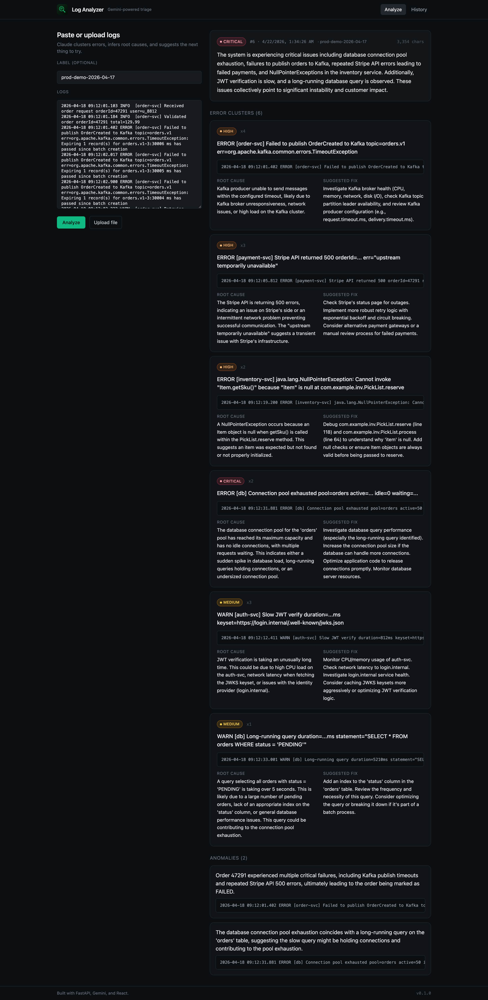
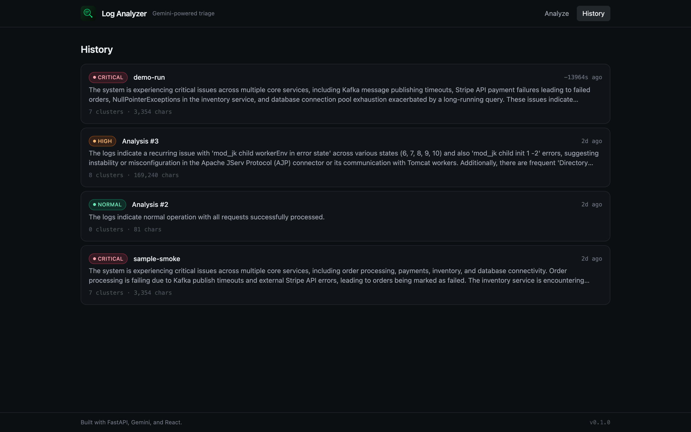
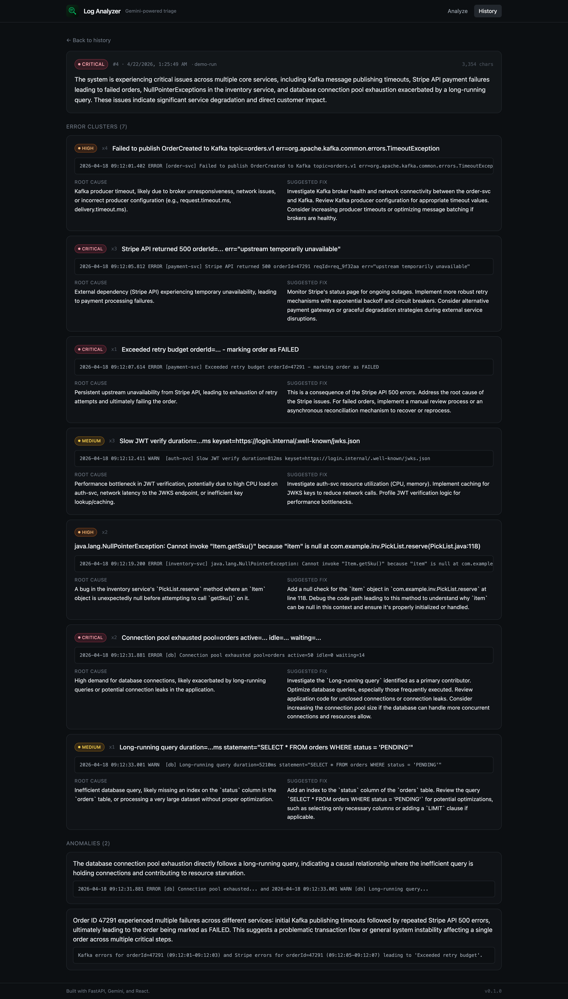

# Log Analyzer

AI-augmented log triage tool. Paste raw application logs, Gemini clusters the errors, infers root causes, and suggests fixes — with a searchable history of every run.



## What it does

- **Error clustering** — groups noisy log lines by shared root cause so you stop reading the same stack trace a hundred times.
- **Root-cause inference** — for each cluster, Gemini names the likely cause (bad config, upstream timeout, exhausted connection pool, etc.) with an evidence line.
- **Suggested fix** — a concrete next action, not a generic "check the logs".
- **Anomaly callouts** — one-off events worth a human's attention even when they don't cluster.
- **Severity rollup** — overall normal / low / medium / high / critical signal driven by a consistent rubric.
- **Persistent history** — every analysis is stored so you can compare a prod incident against last week's clean run.

## Screenshots

Analyze — paste logs, get a clustered breakdown with root causes and fixes:


History — every run is persisted, severity at a glance:



Detail — full clusters, anomalies, and metadata for any prior run:



## Stack

| Layer    | Tech                                                    |
| -------- | ------------------------------------------------------- |
| Backend  | FastAPI, Pydantic, SQLAlchemy 2.0                       |
| LLM      | Google Gen AI SDK (`gemini-2.5-flash`, structured JSON) |
| Storage  | Postgres (Docker) or SQLite (zero-dep local dev)        |
| Frontend | React 18, TypeScript, Vite, Tailwind CSS                |
| Routing  | React Router v6                                         |

The LLM call uses `response_schema=AnalysisResult` so the model returns a typed Pydantic object directly — no brittle JSON-from-prose parsing.

## Getting started

### 1. Backend

```bash
cd backend
python3 -m venv .venv
source .venv/bin/activate
pip install -r requirements.txt

cp .env.example .env
# Put a Gemini key from https://aistudio.google.com/apikey into .env
# For zero-dep local dev, flip DATABASE_URL to the sqlite line in .env.example

.venv/bin/uvicorn app.main:app --reload --port 8000
```

### 2. Frontend

```bash
cd frontend
npm install
npm run dev  # http://localhost:5173
```

### 3. (Optional) Postgres

```bash
cd docker
docker compose up -d
```

## API

| Method | Path                   | Purpose                          |
| ------ | ---------------------- | -------------------------------- |
| POST   | `/api/analyze`         | Analyze a JSON body of log text  |
| POST   | `/api/analyze/upload`  | Analyze an uploaded `.log`/`.txt` |
| GET    | `/api/history`         | List prior analyses              |
| GET    | `/api/history/{id}`    | Full clusters + anomalies        |

Quick smoke test:

```bash
curl -s -X POST http://localhost:8000/api/analyze/upload \
  -F "file=@samples/sample.log" \
  -F "label=smoke" | jq '{id, severity: .result.overall_severity, clusters: (.result.error_clusters | length)}'
```

## Project layout

```
backend/
  app/
    api/          # analyze + history routes
    config.py     # pydantic-settings env loader
    database.py   # SQLAlchemy engine + session_scope
    llm_service.py# Gemini client with structured output
    models.py     # Analysis / ErrorClusterRow / AnomalyRow
    schemas.py    # Pydantic response models
    main.py       # FastAPI app + CORS
  requirements.txt
frontend/
  src/
    api.ts        # fetch wrappers
    pages/        # AnalyzerPage, HistoryPage, DetailPage
    components/   # Layout, ResultView, SeverityBadge
docker/
  docker-compose.yml  # Postgres 16
samples/
  sample.log
```

## Notes

- Logs are truncated at `MAX_LOG_CHARS` (default 200k) before hitting the model.
- On Gemini quota / auth / server errors the API returns `503` with the upstream message surfaced — no silent failures.
- The severity rubric (`normal` / `low` / `medium` / `high` / `critical`) is baked into the system prompt so ratings stay consistent across runs.
